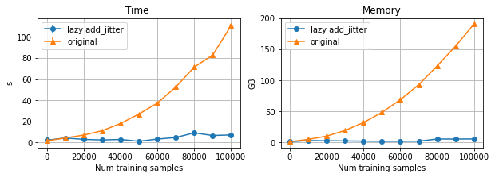

# GPyTorch test
Test for "Latent Function Inference with Pyro + GPyTorch".

### Install
```
# Clone the repository and update submodules
git clone --recurse-submodules https://github.com/pierocor/gpytorch_test.git
cd gpytorch_test

# Create virtual environment
python -m venv lazy
source lazy/bin/activate

# Install required packages
pip install -r requirements.txt

# Install GPyTorch (editable)
pip install -e gpytorch/
```

### Run
To run a single test:
```
python test_pyro_gpytorch.py
```
To run the suite of tests reporting the memory consumption:
```
./run_test.sh
```
> The latter requires GNU time

### Results

By implementing the `add_jitter` method in a lazy fashion, one can avoid the direct evaluation
of the full covariance matrix on the training data. This, in turn, improves substantially the performances of the application. Indeed, the spatial complexity of the algorithm drops from being quadratic to linear w.r.t. the
number of training data. Benefits are visible also in terms of throughput:



Results obtained on a node with 2 processors Intel Xeon IceLake Platinum 8360Y, 256 GB of main memory, PyTorch v1.9.0, GPyTorch v1.5.1, Pyro v1.7.0.


### Python script
Code adapted from [GPyTorch documentation](https://docs.gpytorch.ai/en/v1.5.1/examples/07_Pyro_Integration/Pyro_GPyTorch_Low_Level.html).
